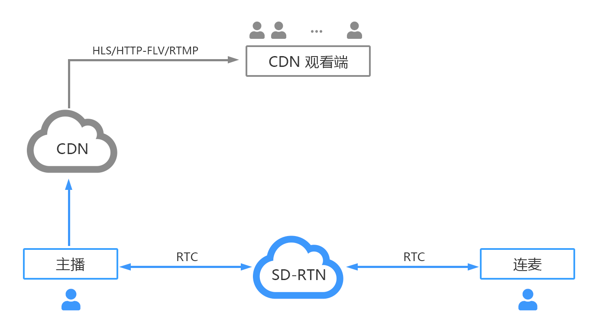
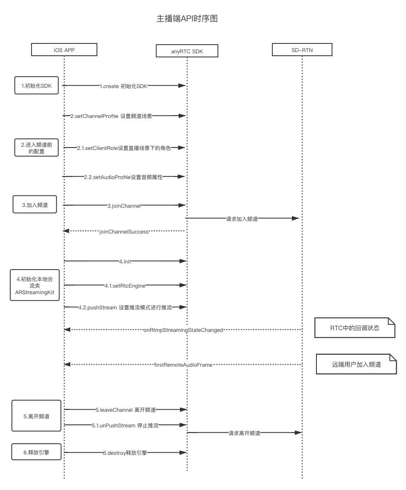
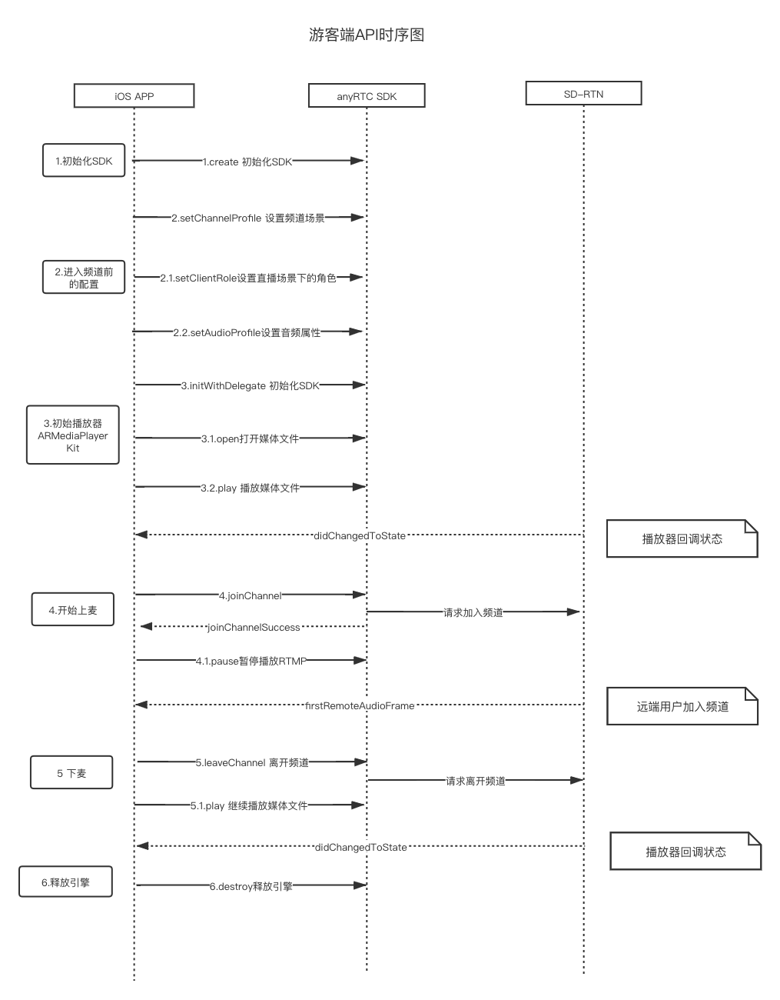

## 项目概述

VideoLive 是anyRTC 所做的视频连麦的示例项目，演示了如何通过anyRTC云服务，并配合anyRTC RTC SDK、anyRTC RTM SDK、anyRTC本地推流插件、anyRTC播放插件，快速实现视频连麦的场景。

- 实时音视频连麦
- 本地音视频合流转推CDN
- 服务器合流转推CDN

## 产品架构

### 主播端调用时序图

主播RTC使用的方法：

| 方法                               | 描述                                 |
| ---------------------------------- | ------------------------------------ |
| create                             | 创建RTC                              |
| setChannelProfile:LiveBroadcasting | 设置频道场景为直播模式               |
| setClientRole:Broadcaster          | 设置直播场景下的角色为主播           |
| setAudioProfile                    | 设置音频属性，建议码率不要超过48kbps |
| joinChannel                        | 加入频道                             |
| leaveChannel                       | 离开频道                             |
| destory                            | 释放引擎                             |

主播本地合流类使用的方法： 

| 方法                 | 描述                                             |
| -------------------- | ------------------------------------------------ |
| init                 | 创建本地合流类                                   |
| setRtcEngine         | 传入RTC句柄                                      |
| pushStream：AudioMix | 设置推流地址和推流模式，该案例中使用音频合流模式 |
| unPushStream         | 停止推流                                         |

### 游客端调用时序图

游客RTC使用的方法：

| 方法                               | 描述                                 |
| ---------------------------------- | ------------------------------------ |
| create                             | 创建RTC                              |
| setChannelProfile:LiveBroadcasting | 设置频道场景为直播模式               |
| setClientRole:Broadcaster          | 设置直播场景下的角色为主播           |
| setAudioProfile                    | 设置音频属性，建议码率不要超过48kbps |
| joinChannel                        | 加入频道                             |
| leaveChanel                        | 离开频道                             |
| destory                            | 释放引擎                             |

主播本地合流类使用的方法：

| 方法                 | 描述                                             |
| -------------------- | ------------------------------------------------ |
| init                 | 创建本地合流类                                   |
| setRtcEngine         | 传入RTC句柄                                      |
| pushStream：AudioMix | 设置推流地址和推流模式，该案例中使用音频合流模式 |
| unPushStream         | 停止推流                                         |

 

**流程：**游客初始化RTC后，初始化播放器，播放RTMP，申请连麦通过后，调用加入频道方法，加入频道成功后，停止播放RTMP。下麦后，调用leaveChannel,并调用播放器的播放进行播放RTMP流：

## RESTful API 说明

该demo有配套RESTful API进行开发，主要模拟用户注册、登录、获取大厅列表、创建直播间、进入直播间、等一些信息。用户参考demo逻辑，配套服务端信息可按照自身业务逻辑去做。

大厅列表除了调用RESTful API 作为主入口，服务上也做了跟RTC服务做了对接，可以实时跟踪异常信息，优化大厅列表。具体查看[服务端对接文档](https://docs.anyrtc.io/cn/AnyRTCCloud/console/ncs_eventtype?platform=Android#%E5%AE%9E%E6%97%B6%E9%80%9A%E4%BF%A1)

## 联系我们

联系电话：021-65650071

QQ咨询群：580477436

咨询邮箱：[hi@dync.cc](mailto:hi@dync.cc)

技术问题：[开发者论坛](https://bbs.anyrtc.io/)

加微信入技术群交流：

获取更多帮助前往：[www.anyrtc.io](http://www.anyrtc.io/)
